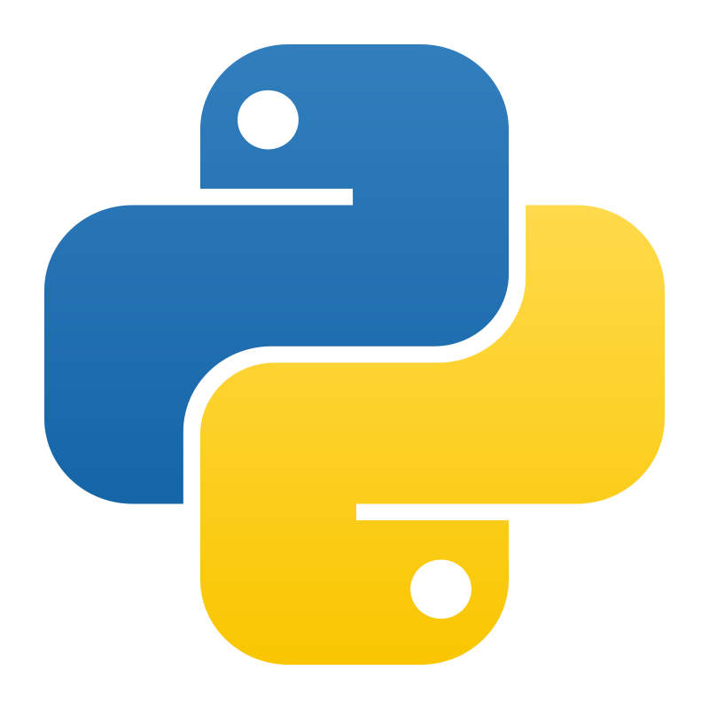
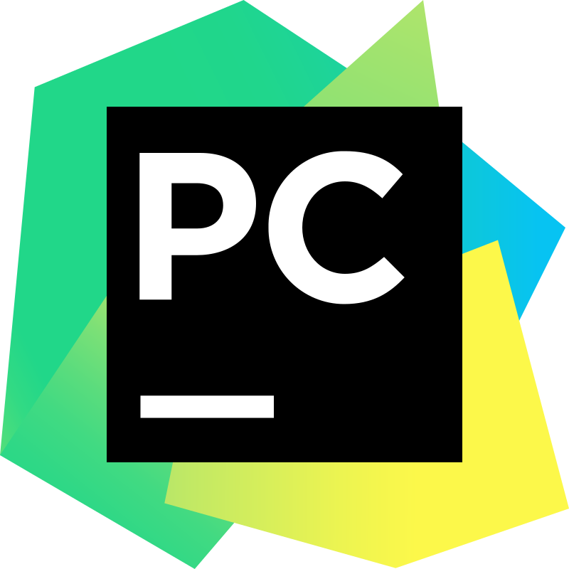

# Hi there, I'm Kate 👋  

🔍 **About Me:**  
- 🚀 Working in IT
- 💡 Specializing in Manual/Automation Testing  
- 🏆 Passionate about finding bugs and improving product quality  

## Stack and tools:

<code></code>
<code></code>
<code></code>
<code></code>
<code></code>

<code></code>
<code></code>
<code></code>
<code></code>
<code></code>
<code></code>

<code></code>
<code></code>
<code></code>
<code></code>
<code></code>
<code></code>
<code></code>
<code></code>

## :unicorn: Pet Projects:
#### Java
:desktop_computer: [4lapy.ru](https://github.com/katinagon/four_paws) - Test automation project (UI+API) for 4lapy.ru  
:iphone: [Wiki-mobile-tests](https://github.com/katinagon/wiki_mobile) - Test automation project for mobile app (Android) "Wikipedia"

#### Python
:desktop_computer: [UI-автотесты для приложения UI Course](https://github.com/katinagon/autotests-ui)
:desktop_computer: [API автотесты для микросервиса Course API](https://github.com/katinagon/autotests-api)

## My Stats

  
  
  
  

## 📫 Contacts:  
   
  
